# 

[TOC]

# [Glob模式](https://www.cnblogs.com/savorboard/p/glob.html)

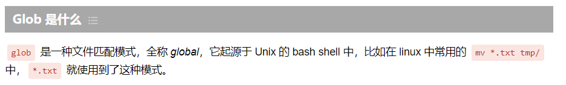

# [BNF](https://hackmd.io/@ShenTengTu/HJzCM3aDr)

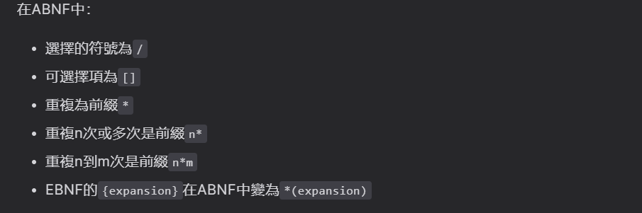

# [github](https://github.com/nsgih/ntool)

## shortcut

```
//快速推送远程(-a~git add;-m~指定message)
//【仅自动跟踪目标对象】
git commit -am "{Your commit message} && git push
```

## [git](https://git-scm.com/book/zh/v2) status

```cpp
git [status | diff]

git add [{文件名}* | . | {目录名}] //到暂存区Staging Area

//remove    
git rm  [ {文件} //删除暂存
	    | --cached {文件} //仅删除暂存，保留在文件系统
        | {\*~}{log/\*.log}  //Glob模式 {~结尾文件}
         					 //{log/目录下扩展名.logs所有文件}
]

git log -p -2   //查看log
git log [--stats] //可选：查看详细状态    

//修订
git commit --amend 
```

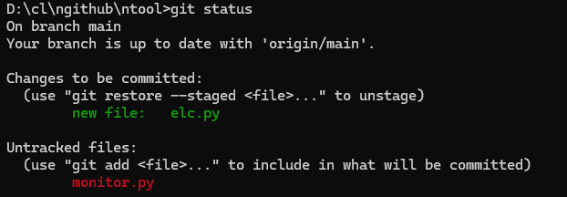

```cpp
//删除
git reset --soft HEAD~1 //软删除，保留工作目录
git reset --hard HEAD~1 //硬删除，回退到【上个提交】
```

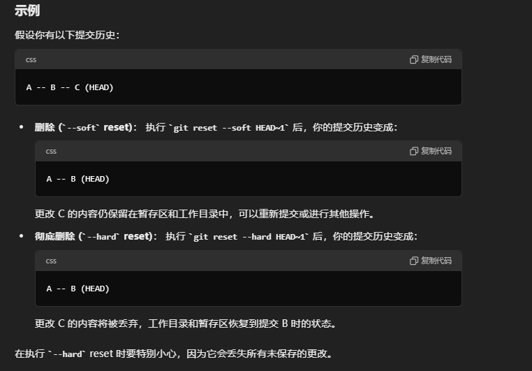

## origin main

```
git remote -v //查看远程仓库
```

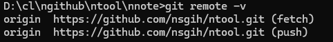

## [git clone配置代理](https://blog.xiaoqi.work/index.php/2024/01/31/hello-world/)

> Q1：挂梯子git clone依旧慢

```
//7890配置代理的端口
git config --global http.proxy "127.0.0.1:7890"  
git config --global https.proxy "127.0.0.1:7890"
```

## [Git  Branch ：新建与合并](https://git-scm.com/book/zh/v2/Git-%E5%88%86%E6%94%AF-%E5%88%86%E6%94%AF%E7%9A%84%E6%96%B0%E5%BB%BA%E4%B8%8E%E5%90%88%E5%B9%B6)

```
# 新建并切换branch
# - git branch iss53
# - git checkout iss53
git checkout -b {issue_code}

#查看branch
git branch 
```

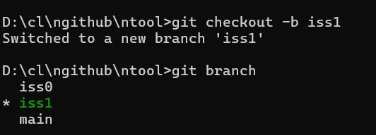

```cpp
# 推送branch到【远程】
git push origin {issue_code}
```

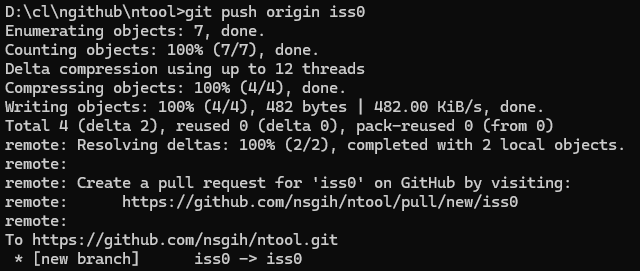

```
# 本地merge
1.【切回default branch】：git checkout main
2.【merge】：git merge iss0
3.【推送远程】：git push origin main
```

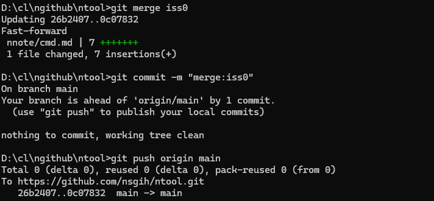

## 案例：merge

> 0.准备：【本地】、【远程】出现冲突先git pull orgin main

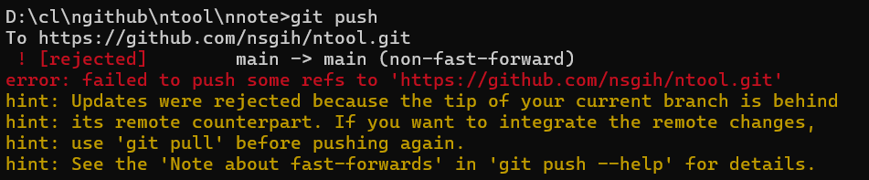

> 1.git pull orgin main，会自动merge。

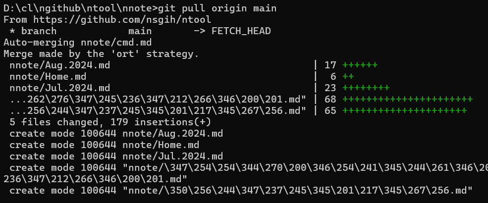

> 2.删除多余内容，修改之后再正常commit、push

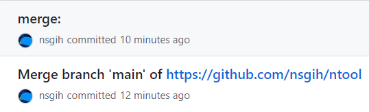

## 案例：远程回退

```cpp
#alg.
1.更新【本地分支】到最新: git pull origin main
2.【本地】回退：git reset --hard HEAD~1
3.强制推送【本地】到远程: git push origin main --force

0a.查看commit message: git log
```

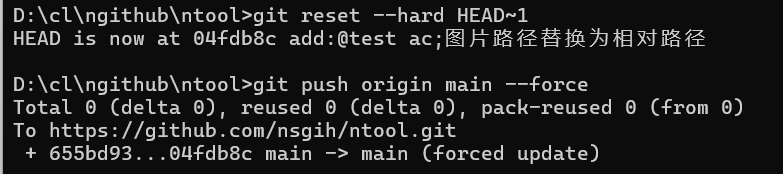

## 案例：删除commit

```
# alg.
1.启动交互式debase：git rebase -i HEAD~{希望回溯数量} #eg. git rebase -i HEAD~5
2.pick to drop：【编辑历史记录；保存退出:wq】
```

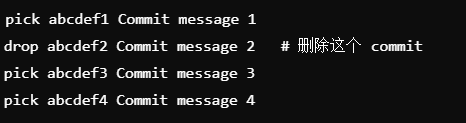

# cmd相关

## start

```cpp
start [{cmd.md}|.]  //打开文件
git diff  //比较暂存staged和文件系统
```

## dir

```
{磁盘} //例如C:
dir //ls -a
cls //cleanscreen

//新建文件        all | wide | page
mrdir [{指定目录}] [/a | /w | /p]

```

## echo 

```cpp
echo [{txt}] > .gitignore  //新建
echo {txt} >> .gitignore //追加
type {markdown}
```

## cmd默认路径

> 算法

```cmd
//cmd默认路径
win+R : regedit
注册表编辑器 ：计算机\HKEY_LOCAL_MACHINE\SOFTWARE\Microsoft\Command Processor
新建 ： 字符串值，命名为autorun
修改 ： cd /d {your_formal_path}
win+R ： 验收结果
    
EOF.
```

> [案例1](https://blog.csdn.net/m0_62975468/article/details/126287883)

```cmd
// cmd 注释
:: {commnet}
```


# pip相关

## pip install 换源

> Q1：换源

```cmd
// 临时换源
pip install markdown -i {src_url}

//永久换源
pip config set global.index-url {src_url}

//源
https://mirrors.aliyun.com/pypi/simple/ :: 阿里云
http://pypi.douban.com/simple/ :: 豆瓣
https://pypi.tuna.tsinghua.edu.cn/simple/ :: 清华大学
http://pypi.mirrors.ustc.edu.cn/simple/ :: 中国科学技术大学 
```


## pip install -r requirement.txt

> Q1: 安装失败

```cpp
// 安装失败时的策略
注释失败的part ： #requirement.txt
最后安装      

EOF.
```

> Q2:常用

```python
//freeze your rqt file
pip freeze > {requirement.txt}

//
```


## pip3 show numpy

> 查看版本

## mod相关

### py -m venv vr-1

> 创建虚拟环境vr-1

```cpp
//venv name and filename at same time
py -m venv {name_of_venv}
```

# test：图床

> Q1配置自动更新assets：typora

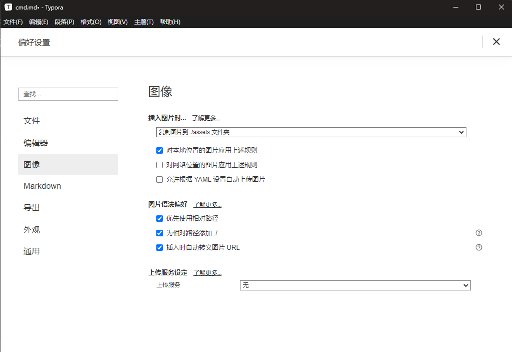


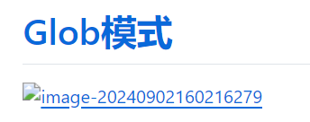

